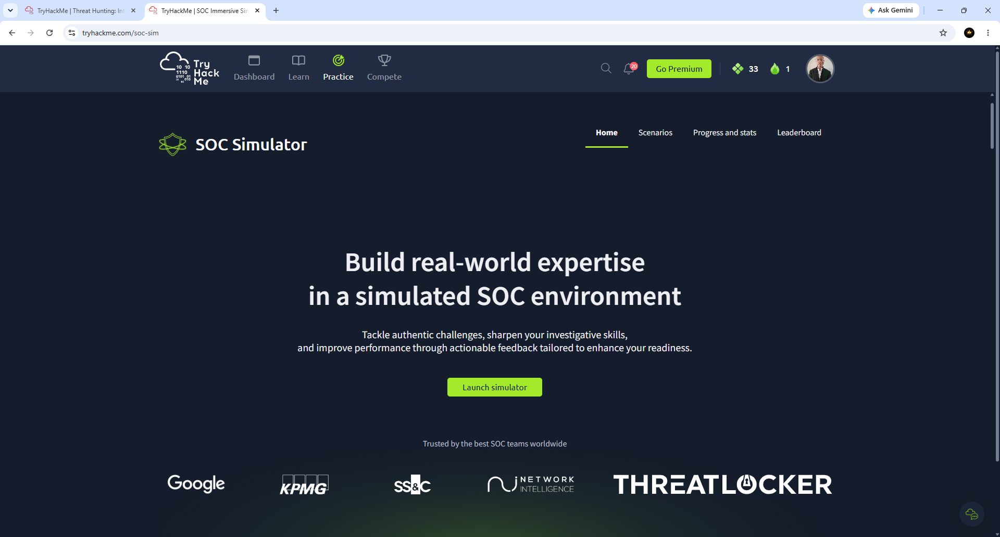
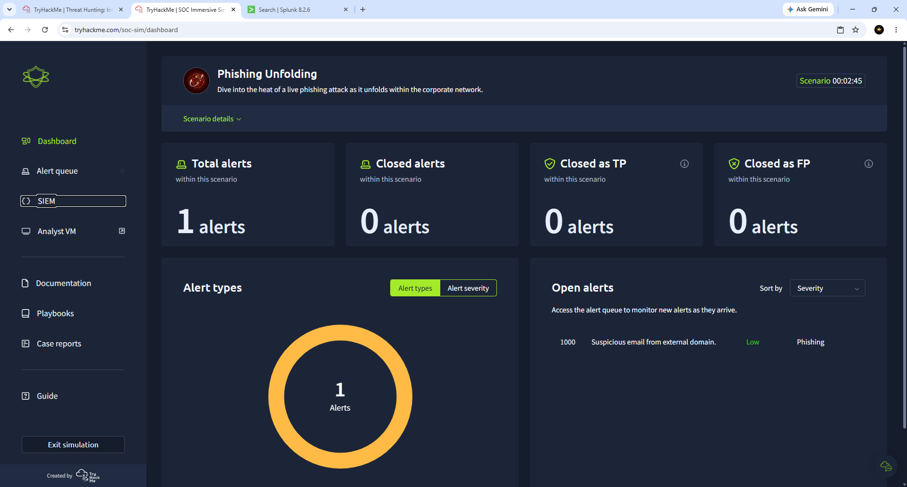
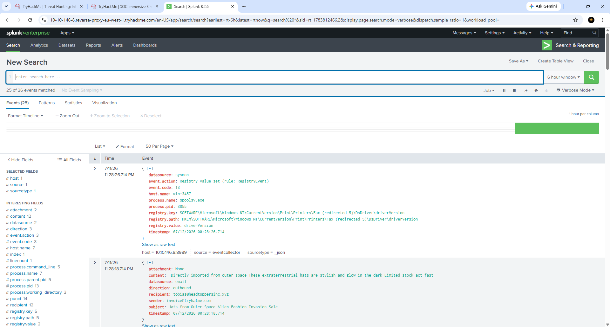
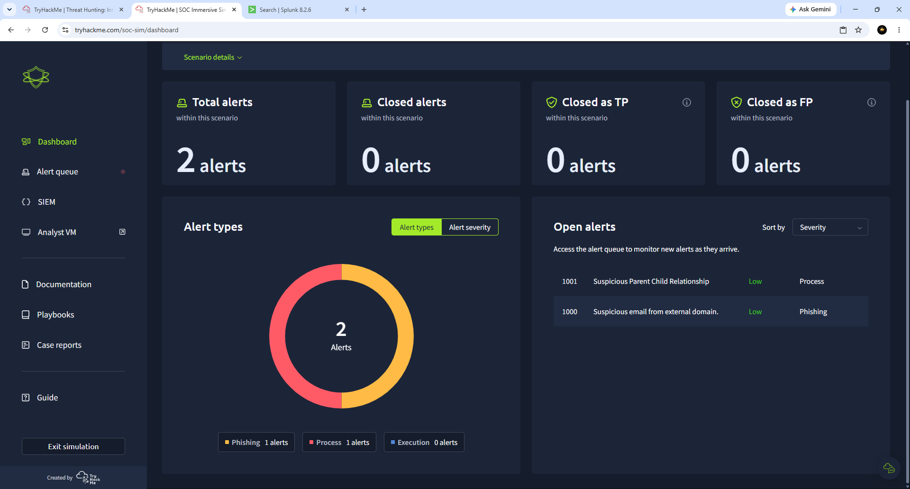
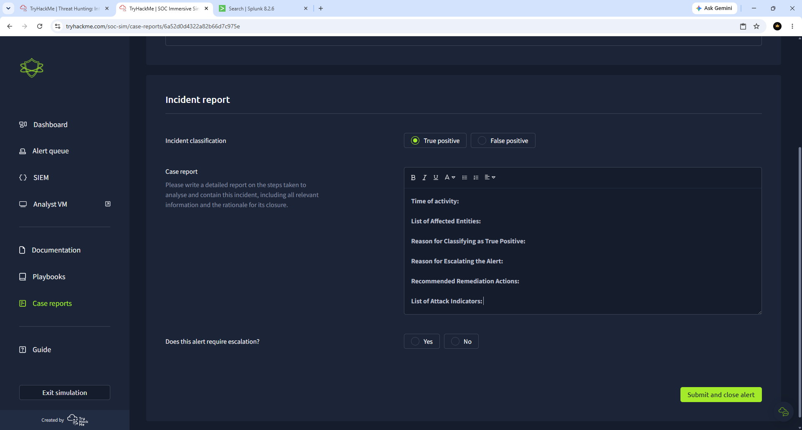
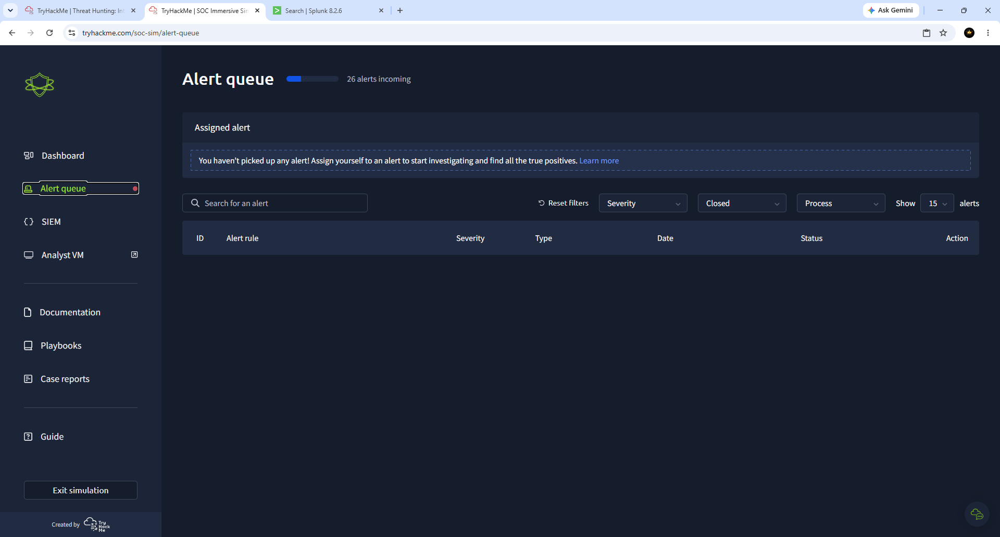
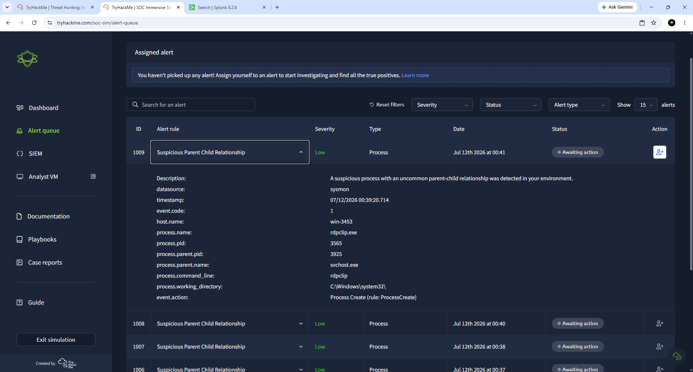
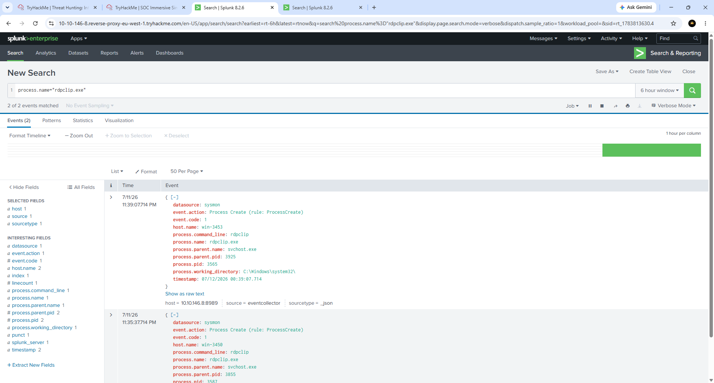
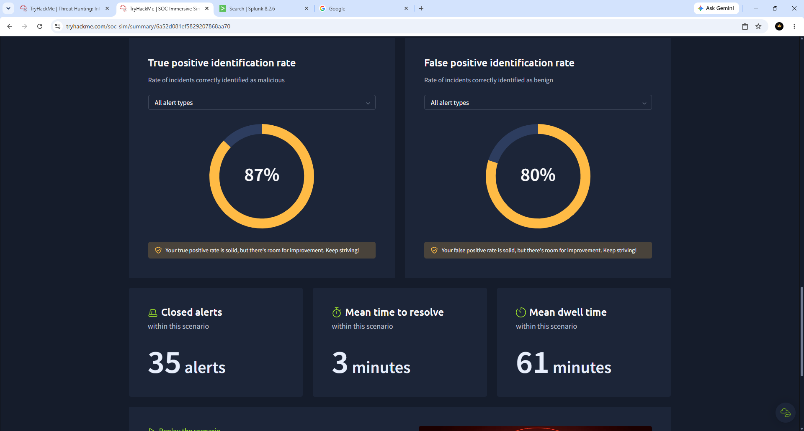

# Darwin-TryHackMe-SOC-Simulator-Lab
Hands-on TryHackMe SOC Simulator lab demonstrating phishing investigation, alert triage, Sysmon log analysis, incident response, false positive validation, true positive detection, and SOC case reporting using real-world security investigation workflows.

## Overview

This project demonstrates hands-on Security Operations Center (SOC) analyst skills through the TryHackMe SOC Simulator. The lab focuses on investigating phishing emails, analyzing Windows Sysmon logs, validating alerts, distinguishing true positives from false positives, documenting incident reports, and following the incident response lifecycle.

Throughout the investigation, alerts were analyzed using log data and supporting evidence to determine whether security events represented legitimate threats or normal system activity.

---

## Skills Demonstrated

- Security Alert Triage
- Incident Investigation
- Phishing Email Analysis
- Sysmon Log Analysis
- Process Investigation
- Parent-Child Process Analysis
- True Positive Identification
- False Positive Validation
- Incident Documentation
- SOC Case Reporting
- Threat Hunting
- Security Operations Workflow

---

## Technologies Used

- TryHackMe SOC Simulator
- Windows Sysmon
- Security Information and Event Monitoring (SIEM)
- Incident Response
- Threat Hunting Methodology

---

# Investigation Workflow

1. Accessed the SOC Simulator dashboard.
2. Reviewed incoming security alerts.
3. Investigated phishing email alerts.
4. Examined Windows Sysmon process events.
5. Distinguished true positives from false positives.
6. Documented incident findings.
7. Closed alerts with supporting evidence.
8. Completed the simulation and reviewed analyst performance metrics.

---

# Screenshots

## 1. SOC Simulator Home

Opened the TryHackMe SOC Simulator and reviewed the phishing investigation scenario.

---

## 2. Alert Received

Reviewed newly generated security alerts awaiting analyst investigation.

---

## 3. Log Analysis

Analyzed security event logs to identify suspicious activity and collect evidence.

---

## 4. Investigation

Performed detailed investigation of alerts using event information and supporting log data.

---

## 5. Threat Confirmed

Validated malicious activity through evidence gathered during the investigation.

---

## 6. Alert Closed

Completed incident documentation and closed the investigated alert.

---

## 7. Second Alert

Investigated additional security alerts generated during the simulation.

---

## 8. Process Investigation

Reviewed suspicious Windows processes and analyzed parent-child process relationships using Sysmon event data.

---

## 9. SOC Simulator Results

Completed the SOC simulation and reviewed overall analyst performance, including true positive rate, false positive rate, mean time to resolve (MTTR), and total alerts investigated.

---

## Key Takeaways

- Investigated phishing email campaigns.
- Validated suspicious process activity using Sysmon.
- Distinguished between malicious activity and legitimate Windows processes.
- Performed incident triage and documentation.
- Practiced SOC analyst workflows used in enterprise environments.
- Improved detection accuracy through evidence-based investigations.

---

## Learning Outcome

This project strengthened practical SOC analyst skills by providing experience with real-world alert investigation, phishing analysis, incident response procedures, process monitoring, and security event documentation in a simulated enterprise environment.

Author: Darwin Brown JR.
Aspiring SOC Tier 1
